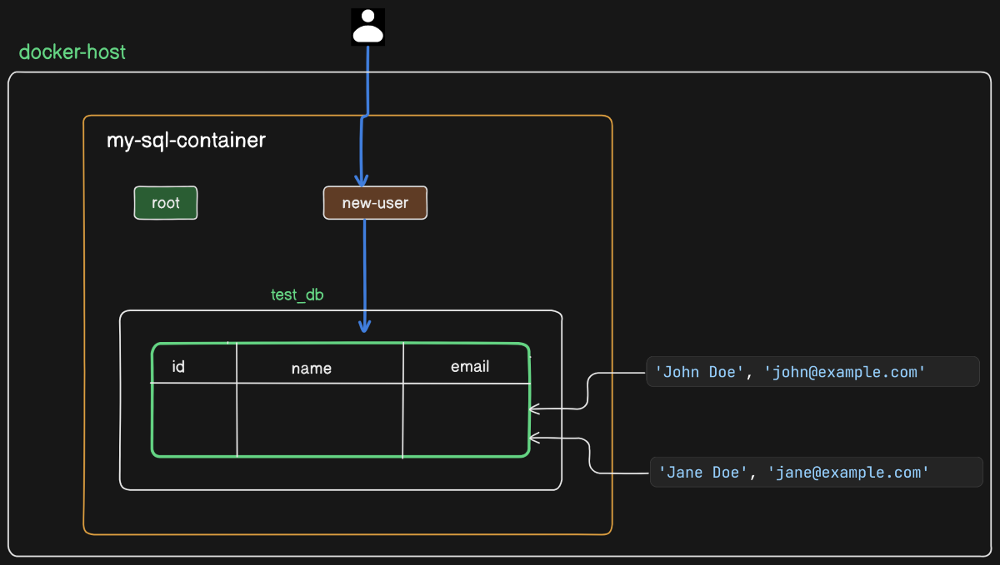
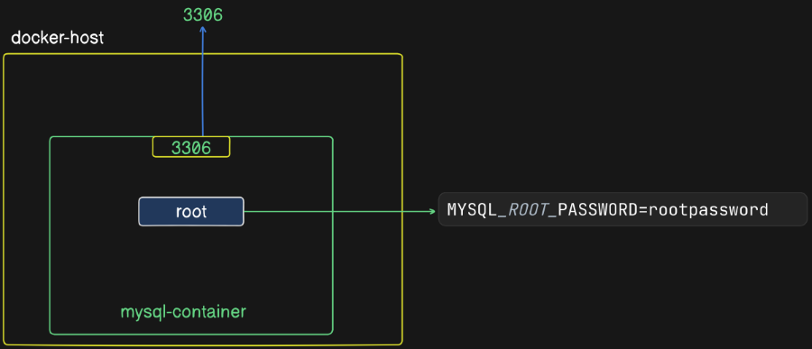
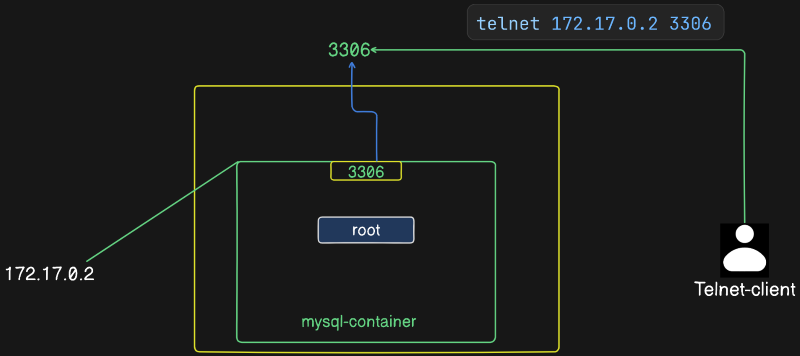
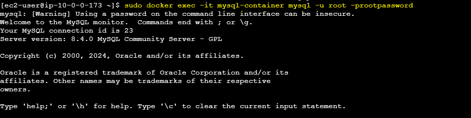
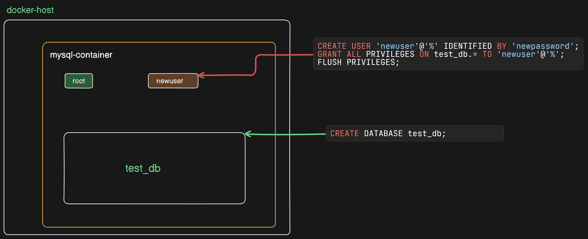
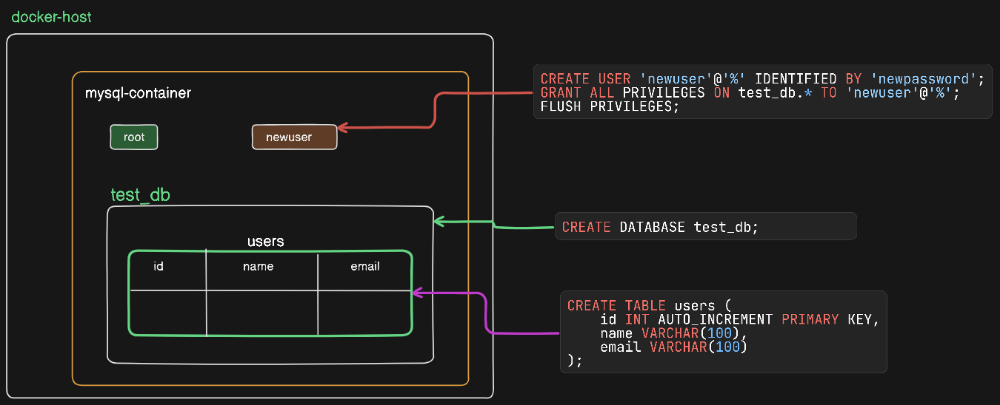
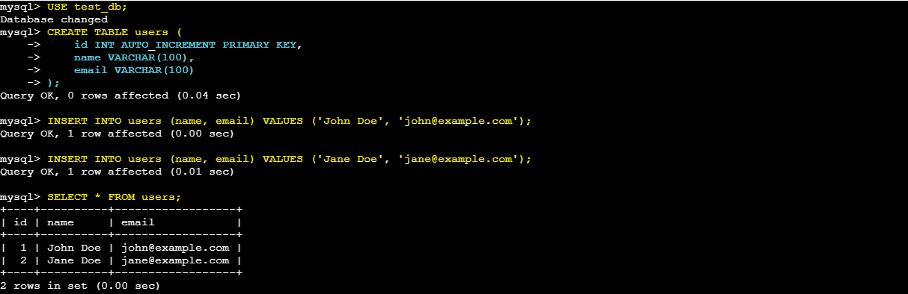
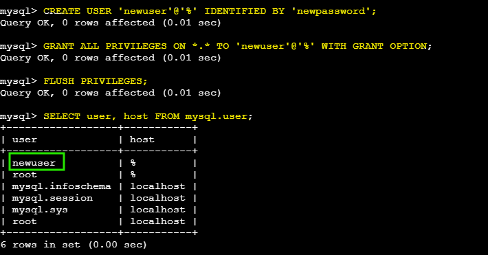

### Working With MySQL container

In this scenario, you will launch a MySQL server using Docker, create a new user with specific permissions, create a database, insert data into a table, and test the MySQL connection using Telnet. Finally, you will display all users in the database and verify the inserted data.



#### 1. Install Docker on Your Instance

1. **Update the installed packages and package cache** on your instance:

   ```sh
   sudo yum update -y
   ```

2. **Install Docker**:

   ```sh
   sudo yum install -y docker
   ```

3. **Start the Docker service**:

   ```sh
   sudo service docker start
   ```

#### 2. Create MySQL Container

1. **Pull the MySQL Docker image**:

   ```sh
   sudo docker pull mysql:latest
   ```

2. **Run the MySQL container**:

   ```sh
   sudo docker run --name mysql-container -e MYSQL_ROOT_PASSWORD=rootpassword -p 3306:3306 -d mysql:latest
   ```

   

3. **Check the running containers**:

   ```sh
   sudo docker ps
   ```

4. **Get the container IP address**:

   ```sh
   sudo docker inspect -f '{{range.NetworkSettings.Networks}}{{.IPAddress}}{{end}}' mysql-container
   ```

#### 3. Test MySQL Connection with Telnet




1. **Install telnet** if it's not already installed:

   ```sh
   sudo yum install telnet -y
   ```

2. **Test the MySQL connection** using the container IP address obtained earlier:

   ```sh
   telnet <container-ip> 3306
   ```

   Replace `<container-ip>` with the actual IP address of your MySQL container. You should see a response indicating that the connection to MySQL is established.

#### 4. Connect to MySQL and Create Database and User

1. **Access the MySQL shell** inside the container:

   ```sh
   docker exec -it mysql-container mysql -u root -prootpassword
   ```

   

   Enter the root password when prompted (`root` in this case).

2. **Create a new database and user**:

   ```sql
   CREATE DATABASE test_db;
   CREATE USER 'newuser'@'%' IDENTIFIED BY 'newpassword';
   GRANT ALL PRIVILEGES ON test_db.* TO 'newuser'@'%';
   FLUSH PRIVILEGES;
   ```

   

3. **Exit the MySQL shell**:

   ```sql
   exit;
   ```

#### 5. Use `newuser` to Create a Table and Insert Data

1. **Log in as `newuser`**:

   ```sh
   docker exec -it mysql-container mysql -u newuser -pnewpassword
   ```

2. **Create a table and insert data**:

   ```sql
   USE test_db;

   CREATE TABLE users (
       id INT AUTO_INCREMENT PRIMARY KEY,
       name VARCHAR(100),
       email VARCHAR(100)
   );

   INSERT INTO users (name, email) VALUES ('John Doe', 'john@example.com');
   INSERT INTO users (name, email) VALUES ('Jane Doe', 'jane@example.com');
   ```
   
   


3. **Show all users in the `users` table**:

   ```sql
   SELECT * FROM users;
   ```

    

4. **Show all MySQL users**:

   ```sql
   SELECT user, host FROM mysql.user;
   ```

  

5. **Exit the MySQL shell**:

   ```sql
   exit;
   ```

This document provides a comprehensive guide to setting up MySQL on your instance using Docker, performing basic database operations, and testing the connection using the container IP address.